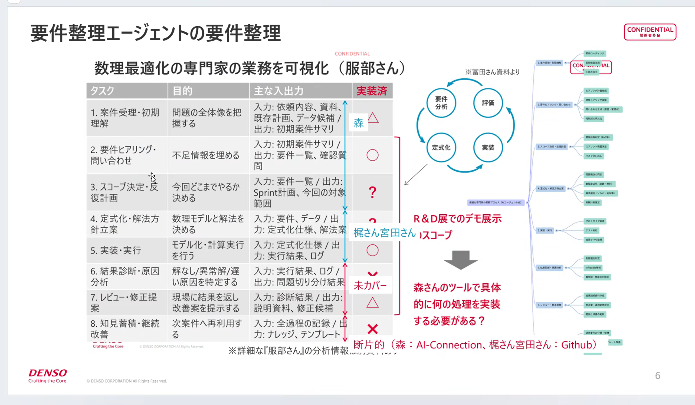

# 最適化支援 サマリ

## 内容
- [[最適化専門家エージェント]]の全体像を確認。
- 添付図を wiki 管理下へ保存。

## 添付図

注記: この環境では画像内容の自動読取ができないため、図そのものを保存して参照可能な形にしている。
- オープンクエスチョン: [[森]]さんは現在何をやっているか？

## 関連
- プロジェクト: [[最適化支援]]
- エージェント: [[最適化専門家エージェント]]
